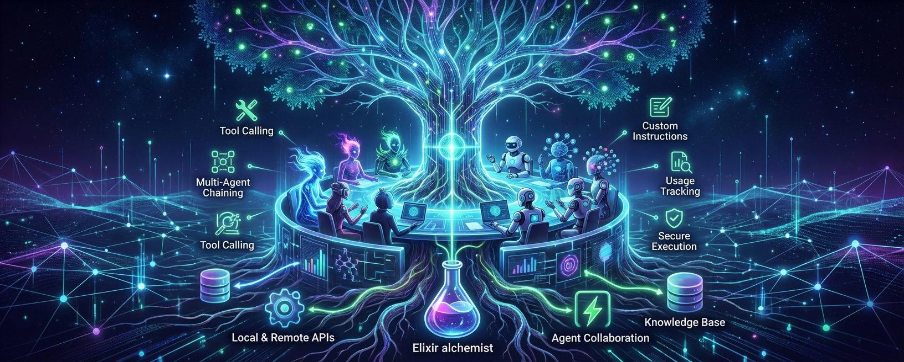

# Nous AI

> *"Nous (νοῦς) — the ancient Greek concept of mind, reason, and intellect; the faculty of understanding that grasps truth directly."*

AI agent framework for Elixir with multi-provider LLM support.

[](https://elixir-lang.org)
[](https://github.com/nyo16/nous/blob/master/LICENSE)
[](#features)

## Installation

Add to your `mix.exs`:

```elixir
def deps do
  [
    {:nous, "~> 0.8.1"}
  ]
end
```

Then run:
```bash
mix deps.get
```

## Quick Start

### Simple Text Generation

For quick LLM calls without agents:

```elixir
# One-liner
{:ok, text} = Nous.generate_text("lmstudio:qwen3", "What is Elixir?")
IO.puts(text)

# With options
{:ok, text} = Nous.generate_text("openai:gpt-4", "Explain monads",
  system: "You are a functional programming expert",
  temperature: 0.7,
  max_tokens: 500
)

# Streaming
{:ok, stream} = Nous.stream_text("lmstudio:qwen3", "Write a haiku")
stream |> Stream.each(&IO.write/1) |> Stream.run()

# With prompt templates
alias Nous.PromptTemplate

template = PromptTemplate.from_template("""
Summarize the following text in <%= @style %> style:

<text>
<%= @content %>
</text>
""")

prompt = PromptTemplate.format(template, %{
  style: "bullet points",
  content: "Elixir is a dynamic, functional language for building scalable applications..."
})

{:ok, summary} = Nous.generate_text("openai:gpt-4", prompt)
```

### With Agents

For multi-turn conversations, tools, and complex workflows:

```elixir
# Create an agent
agent = Nous.new("lmstudio:qwen3",
  instructions: "Be helpful and concise."
)

# Run it
{:ok, result} = Nous.run(agent, "What is Elixir?")

IO.puts(result.output)
IO.puts("Tokens: #{result.usage.total_tokens}")
```

## Supported Providers

| Provider | Model String | Streaming |
|----------|-------------|-----------|
| LM Studio | `lmstudio:qwen3` | ✅ |
| OpenAI | `openai:gpt-4` | ✅ |
| Anthropic | `anthropic:claude-sonnet-4-5-20250929` | ✅ |
| Groq | `groq:llama-3.1-70b-versatile` | ✅ |
| Ollama | `ollama:llama2` | ✅ |
| OpenRouter | `openrouter:anthropic/claude-3.5-sonnet` | ✅ |
| Together AI | `together:meta-llama/Llama-3-70b-chat-hf` | ✅ |
| Custom | `openai_compatible:model` + `:base_url` | ✅ |

All providers use pure Elixir HTTP clients (Req + Finch).

```elixir
# Switch providers with one line change
agent = Nous.new("lmstudio:qwen3")                  # Local (free)
agent = Nous.new("openai:gpt-4")                    # OpenAI
agent = Nous.new("anthropic:claude-sonnet-4-5-20250929")   # Anthropic
```

## Features

### Tool Calling

Define Elixir functions as tools. The AI calls them automatically when needed.

```elixir
get_weather = fn _ctx, %{"city" => city} ->
  %{city: city, temperature: 72, conditions: "sunny"}
end

agent = Nous.new("openai:gpt-4",
  instructions: "You can check the weather.",
  tools: [get_weather]
)

{:ok, result} = Nous.run(agent, "What's the weather in Tokyo?")
```

### Tools with Context

Pass dependencies (user, database, API keys) via context:

```elixir
get_balance = fn ctx, _args ->
  user = ctx.deps[:user]
  %{balance: user.balance}
end

agent = Nous.new("openai:gpt-4", tools: [get_balance])

{:ok, result} = Nous.run(agent, "What's my balance?",
  deps: %{user: %{id: 123, balance: 1000}}
)
```

### Context Continuation

Continue conversations with full context preservation:

```elixir
{:ok, result1} = Nous.run(agent, "My name is Alice")
{:ok, result2} = Nous.run(agent, "What's my name?", context: result1.context)
# => "Your name is Alice"
```

### Streaming

```elixir
{:ok, stream} = Nous.run_stream(agent, "Write a haiku")

stream
|> Enum.each(fn
  {:text_delta, text} -> IO.write(text)
  {:finish, _} -> IO.puts("")
  _ -> :ok
end)
```

### Callbacks

Monitor execution with callbacks or process messages:

```elixir
# Map-based callbacks
{:ok, result} = Nous.run(agent, "Hello",
  callbacks: %{
    on_llm_new_delta: fn _event, delta -> IO.write(delta) end,
    on_tool_call: fn _event, call -> IO.puts("Tool: #{call.name}") end
  }
)

# Process messages (for LiveView)
{:ok, result} = Nous.run(agent, "Hello", notify_pid: self())
# Receives: {:agent_delta, text}, {:tool_call, call}, {:agent_complete, result}
```

### Module-Based Tools

Define tools as modules for better organization and testability:

```elixir
defmodule MyTools.Search do
  @behaviour Nous.Tool.Behaviour

  @impl true
  def metadata do
    %{
      name: "search",
      description: "Search the web",
      parameters: %{
        "type" => "object",
        "properties" => %{
          "query" => %{"type" => "string"}
        },
        "required" => ["query"]
      }
    }
  end

  @impl true
  def execute(ctx, %{"query" => query}) do
    http = ctx.deps[:http_client] || MyApp.HTTP
    {:ok, http.search(query)}
  end
end

agent = Nous.new("openai:gpt-4",
  tools: [Nous.Tool.from_module(MyTools.Search)]
)
```

### Tool Context Updates

Tools can modify context state for subsequent calls:

```elixir
alias Nous.Tool.ContextUpdate

add_item = fn ctx, %{"item" => item} ->
  items = ctx.deps[:cart] || []
  {:ok, %{added: item}, ContextUpdate.set(ContextUpdate.new(), :cart, items ++ [item])}
end
```

### Prompt Templates

Build prompts with EEx variable substitution:

```elixir
alias Nous.PromptTemplate

template = PromptTemplate.from_template(
  "You are a <%= @role %> who speaks <%= @language %>.",
  role: :system
)

message = PromptTemplate.to_message(template, %{role: "teacher", language: "Spanish"})
{:ok, result} = Nous.run(agent, messages: [message, Message.user("Hello")])
```

### ReActAgent

For complex multi-step reasoning with planning:

```elixir
agent = Nous.ReActAgent.new("openai:gpt-4",
  tools: [&search/2, &calculate/2]
)

{:ok, result} = Nous.run(agent,
  "Research the population of Tokyo and calculate its density"
)
```

### LiveView Integration

```elixir
defmodule MyAppWeb.ChatLive do
  use MyAppWeb, :live_view

  def mount(_params, _session, socket) do
    agent = Nous.new("lmstudio:qwen3", instructions: "Be helpful.")
    {:ok, assign(socket, agent: agent, messages: [], streaming: false)}
  end

  def handle_event("send", %{"message" => msg}, socket) do
    Task.start(fn ->
      Nous.run(socket.assigns.agent, msg, notify_pid: socket.root_pid)
    end)
    {:noreply, assign(socket, streaming: true)}
  end

  def handle_info({:agent_delta, text}, socket) do
    {:noreply, update(socket, :current, &(&1 <> text))}
  end

  def handle_info({:agent_complete, result}, socket) do
    messages = socket.assigns.messages ++ [%{role: :assistant, content: result.output}]
    {:noreply, assign(socket, messages: messages, streaming: false)}
  end
end
```

See [examples/advanced/liveview_integration.exs](examples/advanced/liveview_integration.exs) for complete patterns.

## Examples

**[Full Examples Collection](examples/README.md)** - 21 focused examples from basics to production.

### Core Examples (01-10)

| Example | Description |
|---------|-------------|
| [01_hello_world.exs](examples/01_hello_world.exs) | Minimal example |
| [02_with_tools.exs](examples/02_with_tools.exs) | Tool calling |
| [03_streaming.exs](examples/03_streaming.exs) | Streaming responses |
| [04_conversation.exs](examples/04_conversation.exs) | Multi-turn with context |
| [05_callbacks.exs](examples/05_callbacks.exs) | Callbacks + LiveView |
| [06_prompt_templates.exs](examples/06_prompt_templates.exs) | EEx templates |
| [07_module_tools.exs](examples/07_module_tools.exs) | Module-based tools |
| [08_tool_testing.exs](examples/08_tool_testing.exs) | Test helpers |
| [09_agent_server.exs](examples/09_agent_server.exs) | GenServer agent |
| [10_react_agent.exs](examples/10_react_agent.exs) | ReAct pattern |

### Provider Examples

- [providers/anthropic.exs](examples/providers/anthropic.exs) - Claude, extended thinking
- [providers/openai.exs](examples/providers/openai.exs) - GPT models
- [providers/lmstudio.exs](examples/providers/lmstudio.exs) - Local AI
- [providers/switching_providers.exs](examples/providers/switching_providers.exs) - Provider comparison

### Advanced Examples

- [advanced/context_updates.exs](examples/advanced/context_updates.exs) - Tool state management
- [advanced/error_handling.exs](examples/advanced/error_handling.exs) - Retries, fallbacks
- [advanced/telemetry.exs](examples/advanced/telemetry.exs) - Metrics, cost tracking
- [advanced/cancellation.exs](examples/advanced/cancellation.exs) - Task cancellation
- [advanced/liveview_integration.exs](examples/advanced/liveview_integration.exs) - LiveView patterns

## Telemetry

Attach handlers for monitoring:

```elixir
Nous.Telemetry.attach_default_handler()
```

**Events:**
- `[:nous, :agent, :run, :start/stop/exception]`
- `[:nous, :agent, :iteration, :start/stop]`
- `[:nous, :provider, :request, :start/stop/exception]`
- `[:nous, :tool, :execute, :start/stop/exception]`
- `[:nous, :tool, :timeout]`
- `[:nous, :context, :update]`

## Architecture

```
Nous.new/2 → Agent struct
    ↓
Nous.run/3 → AgentRunner
    ↓
├─→ Context (messages, deps, callbacks)
├─→ Behaviour (BasicAgent | ReActAgent | custom)
├─→ ModelDispatcher → Provider → HTTP
├─→ ToolExecutor (timeout, validation)
└─→ Callbacks (map | notify_pid)
```

## Contributing

Contributions welcome! See [CHANGELOG.md](CHANGELOG.md) for recent changes.

## License

Apache 2.0 - see [LICENSE](https://github.com/nyo16/nous/blob/master/LICENSE)

## Credits

- Inspired by [Pydantic AI](https://ai.pydantic.dev/)
- HTTP: [Req](https://github.com/wojtekmach/req) + [Finch](https://github.com/sneako/finch)
