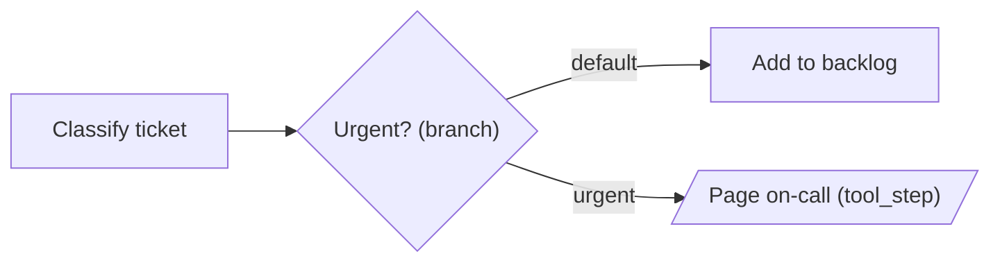

# Workflow Engine Guide

The `Nous.Workflow` module provides a DAG/graph-based workflow engine for orchestrating agents, tools, and control flow as executable directed graphs.

## Overview

Workflows complement existing Nous systems:

- **Decisions** track *why* an agent made choices (reasoning graph)
- **Workflows** define *what* executes and *when* (execution graph)
- **Teams** manage persistent agent groups; Workflows define transient execution plans

## Quick Start

```elixir
alias Nous.Workflow

graph =
  Workflow.new("my_pipeline")
  |> Workflow.add_node(:fetch, :agent_step, %{
    agent: Nous.Agent.new("lmstudio:qwen3", instructions: "Fetch information."),
    prompt: fn state -> "Research: #{state.data.topic}" end,
    result_key: :research
  })
  |> Workflow.add_node(:process, :transform, %{
    transform_fn: fn data -> Map.put(data, :processed, String.upcase(data.research)) end
  })
  |> Workflow.chain([:fetch, :process])

{:ok, state} = Workflow.run(graph, %{topic: "Elixir"})
IO.puts(state.data.processed)
```

## Node Types

| Type | Purpose | Config Keys |
|------|---------|-------------|
| `:agent_step` | Run an LLM agent | `:agent`, `:prompt`, `:result_key` |
| `:tool_step` | Execute a tool function | `:tool`, `:args` |
| `:transform` | Pure data transformation | `:transform_fn` (arity 1) |
| `:branch` | Conditional routing | (uses edge conditions) |
| `:parallel` | Static fan-out to named branches | `:branches`, `:merge` |
| `:parallel_map` | Dynamic fan-out over runtime data | `:items`, `:handler`, `:max_concurrency` |
| `:human_checkpoint` | Pause for human review | `:handler`, `:prompt` |
| `:subworkflow` | Nested workflow | `:workflow`, `:input_mapper`, `:output_mapper` |

## Building Graphs

The API follows the `Ecto.Multi` builder pattern — pipe-friendly struct accumulation:

```elixir
graph =
  Workflow.new("pipeline_id")
  |> Workflow.add_node(:step1, :transform, %{transform_fn: &process/1})
  |> Workflow.add_node(:step2, :agent_step, %{agent: my_agent, prompt: "..."})
  |> Workflow.add_node(:step3, :transform, %{transform_fn: &finalize/1})
  |> Workflow.chain([:step1, :step2, :step3])
```

### Connecting Nodes

```elixir
# Sequential edge (always followed)
|> Workflow.connect(:a, :b)

# Conditional edge (followed when predicate is true)
|> Workflow.connect(:check, :path_a, condition: fn s -> s.data.score > 0.8 end)

# Default edge (fallback when no conditional matches)
|> Workflow.connect(:check, :path_b, default: true)

# Chain shorthand
|> Workflow.chain([:a, :b, :c, :d])
```

## Branching

Route execution based on state:

```elixir
graph =
  Workflow.new("branch_demo")
  |> Workflow.add_node(:evaluate, :transform, %{transform_fn: &score/1})
  |> Workflow.add_node(:check, :branch, %{})
  |> Workflow.add_node(:publish, :transform, %{transform_fn: &publish/1})
  |> Workflow.add_node(:revise, :transform, %{transform_fn: &revise/1})
  |> Workflow.connect(:evaluate, :check)
  |> Workflow.connect(:check, :publish, condition: fn s -> s.data.quality >= 0.8 end)
  |> Workflow.connect(:check, :revise, condition: fn s -> s.data.quality < 0.8 end)
```

## Parallel Execution

### Static Parallel (Named Branches)

```elixir
|> Workflow.add_node(:fan_out, :parallel, %{
  branches: [:web_search, :paper_search, :code_search],
  merge: :deep_merge,          # or :list_collect, or custom fn
  max_concurrency: 3,
  on_branch_error: :continue_others  # or :fail_fast
})
```

### Dynamic Parallel (parallel_map)

Fan out over a runtime-computed list:

```elixir
|> Workflow.add_node(:fetch_all, :parallel_map, %{
  items: fn state -> state.data.urls end,       # list from state
  handler: fn url, _state -> fetch(url) end,    # runs per item
  max_concurrency: 10,
  result_key: :fetched_pages,
  on_error: :collect                            # or :fail_fast
})
```

## Cycles (Retry Loops)

Enable with `allows_cycles: true`. The engine enforces `max_iterations` per node:

```elixir
graph =
  Graph.new("quality_loop", allows_cycles: true)
  |> Graph.add_node(:write, :agent_step, %{agent: writer, prompt: "..."})
  |> Graph.add_node(:evaluate, :transform, %{transform_fn: &score/1})
  |> Graph.add_node(:check, :branch, %{})
  |> Graph.add_node(:done, :transform, %{transform_fn: &finalize/1})
  |> Graph.connect(:write, :evaluate)
  |> Graph.connect(:evaluate, :check)
  |> Graph.connect(:check, :done, condition: fn s -> s.data.score >= 0.8 end)
  |> Graph.connect(:check, :write, condition: fn s -> s.data.score < 0.8 end)

Workflow.run(graph, %{}, max_iterations: 5)
```

## Human-in-the-Loop

Three patterns:

```elixir
# 1. Handler approves immediately
|> Workflow.add_node(:review, :human_checkpoint, %{
  handler: fn state, prompt -> :approve end
})

# 2. Handler edits state before continuing
|> Workflow.add_node(:review, :human_checkpoint, %{
  handler: fn state, _prompt ->
    {:edit, State.update_data(state, &Map.put(&1, :text, "revised"))}
  end
})

# 3. No handler — workflow suspends, returns {:suspended, state, checkpoint}
|> Workflow.add_node(:review, :human_checkpoint, %{prompt: "Awaiting review"})
```

## Hooks

Intercept execution at node boundaries:

```elixir
pre_hook = %Nous.Hook{
  event: :pre_node,
  type: :function,
  handler: fn _event, %{node_id: id, node_type: type} ->
    Logger.info("Executing #{id} (#{type})")
    :allow  # or {:pause, reason} to suspend
  end
}

post_hook = %Nous.Hook{
  event: :post_node,
  type: :function,
  handler: fn _event, %{node_id: id, state: state} ->
    {:modify, State.update_data(state, &Map.put(&1, :last_node, id))}
  end
}

Workflow.run(graph, %{}, hooks: [pre_hook, post_hook])
```

## Error Strategies

Per-node error handling:

```elixir
# Halt immediately (default)
|> Workflow.add_node(:step, :transform, config, error_strategy: :fail_fast)

# Skip and continue
|> Workflow.add_node(:step, :transform, config, error_strategy: :skip)

# Retry with backoff
|> Workflow.add_node(:step, :agent_step, config, error_strategy: {:retry, 3, 1000})

# Route to fallback node
|> Workflow.add_node(:step, :agent_step, config, error_strategy: {:fallback, "safe_step"})
```

## Subworkflows

Nest workflows with data isolation:

```elixir
inner = Graph.new("sub") |> Graph.add_node(:process, :transform, %{...})

|> Workflow.add_node(:sub, :subworkflow, %{
  workflow: inner,
  input_mapper: fn data -> %{input: data.raw} end,     # parent -> child
  output_mapper: fn data -> %{result: data.output} end  # child -> parent
})
```

## Observability

### Telemetry Events

- `[:nous, :workflow, :run, :start]` / `:stop` / `:exception`
- `[:nous, :workflow, :node, :start]` / `:stop` / `:exception`

## Visualization & tracing

Three small modules answer the three questions a graph engine always raises: *what does this pipeline look like*, *what did that run actually do*, and *why is my state so big*.

### Diagrams — `Nous.Workflow.Mermaid`

`Workflow.to_mermaid/2` delegates to `Nous.Workflow.Mermaid.to_mermaid/2`, which turns a graph into a Mermaid `flowchart` string. It only reads the graph, so you can diagram a pipeline before it has ever executed. The one option is `:direction` — `"TD"` (default) or `"LR"`.

```elixir
alias Nous.Workflow

graph =
  Workflow.new("triage")
  |> Workflow.add_node(:classify, :agent_step, %{agent: classifier, prompt: "..."},
    label: "Classify ticket"
  )
  |> Workflow.add_node(:route, :branch, %{}, label: "Urgent?")
  |> Workflow.add_node(:page, :tool_step, %{tool: pager, args: %{}}, label: "Page on-call")
  |> Workflow.add_node(:queue, :transform, %{transform_fn: &enqueue/1}, label: "Add to backlog")
  |> Workflow.connect(:classify, :route)
  |> Workflow.connect(:route, :page, condition: &urgent?/1, label: "urgent")
  |> Workflow.connect(:route, :queue, default: true)

IO.puts(Workflow.to_mermaid(graph, direction: "LR"))
```

Output:



The rendering rules:

- Nodes come first, sorted by node id; then edges, grouped by source node. Edges leaving one node appear in *reverse* declaration order — `connect/4` prepends to the adjacency list.
- A node's text is its `:label`, falling back to the node id. Every type except `:agent_step` and `:transform` also gets a ` (type)` suffix, so a diagram reads without a legend.
- Conditional edges are labelled with the edge's `:label` (or the word `condition` when you did not pass one); default edges are labelled `default`.
- `:parallel` nodes additionally emit a dotted `-.->` line to every id in their `:branches` config, so fan-out targets appear even though no explicit edge connects them.

Shapes are chosen per node type:

| Node type | Shape |
|-----------|-------|
| `:agent_step`, `:transform` | `["..."]` rectangle |
| `:tool_step` | `[/"..."/]` parallelogram |
| `:branch` | `{"..."}` rhombus |
| `:parallel`, `:parallel_map` | `{{"..."}}` hexagon |
| `:human_checkpoint` | `(["..."])` stadium |
| `:subworkflow` | `[["..."]]` subroutine |

### Traces — `Nous.Workflow.Trace`

Pass `trace: true` to `Workflow.run/3` and the engine records one entry per node execution. The resulting `%Nous.Workflow.Trace{}` is attached to `state.metadata.trace` when the run completes *or* suspends; without the option there is no `:trace` key at all.

```elixir
{:ok, state} = Workflow.run(graph, %{}, trace: true)
trace = state.metadata.trace

for entry <- trace.entries do
  IO.puts("#{entry.node_id} (#{entry.node_type}): #{entry.status} in #{entry.duration_ms}ms")
end

IO.puts("#{Nous.Workflow.Trace.node_count(trace)} nodes in #{Nous.Workflow.Trace.total_duration_ms(trace)}ms")
```

The trace struct carries a random `:run_id`, the `:started_at` timestamp of the trace itself, and `:entries` appended in completion order. Each entry is a plain map:

| Key | Type | Meaning |
|-----|------|---------|
| `:node_id` | `String.t()` | Node id as stored in the graph (a string, not the atom you passed to `add_node/5`). |
| `:node_type` | `atom()` | `:agent_step`, `:transform`, … |
| `:status` | `atom()` | `:completed`, `:failed`, or `:suspended`. |
| `:duration_ms` | `non_neg_integer()` | Measured in native units, converted to milliseconds. |
| `:started_at` | `DateTime.t()` | Derived — `completed_at` minus `duration_ms`, not a separately sampled clock read. |
| `:completed_at` | `DateTime.t()` | When the entry was recorded. |
| `:error` | `term()` | Failure reason for `:failed` entries, `nil` otherwise. |

`Nous.Workflow.Trace.total_duration_ms/1` sums the per-node durations, so it is *not* wall-clock time when a `:parallel` or `:parallel_map` node ran branches concurrently. Use the `[:nous, :workflow, :run, :stop]` telemetry measurement for wall clock.

### Large payloads — `Nous.Workflow.Scratch`

If a step produces fetched HTML, an image, or a multi-megabyte CSV, keeping it in `state.data` makes every later step drag it along: `:parallel` and `:parallel_map` fan out through `Task.Supervisor.async_stream_nolink/4`, which copies the state into each task and the result back, and checkpoints persist whatever the state holds. `Nous.Workflow.Scratch` is the escape hatch — a public ETS table you write the bulk into, leaving only a key (or a size, or a summary) in the state itself.

```elixir
alias Nous.Workflow.Scratch

# new/0 does not create the table; the first put/3 does — and only the struct it
# returns holds the table id. Seed it once, then close over that struct.
scratch = Scratch.put(Scratch.new(), :__init__, :ok)

graph =
  Workflow.new("scrape")
  |> Workflow.add_node(:fetch, :transform, %{
    transform_fn: fn data ->
      body = fetch_page(data.url)
      Scratch.put(scratch, :body, body)
      Map.put(data, :body_bytes, byte_size(body))
    end
  })
  |> Workflow.add_node(:extract, :transform, %{
    transform_fn: fn data ->
      Map.put(data, :title, extract_title(Scratch.get(scratch, :body, "")))
    end
  })
  |> Workflow.chain([:fetch, :extract])

{:ok, state} = Workflow.run(graph, %{url: "https://example.com"})
Scratch.cleanup(scratch)
```

The API is five functions: `new/0`, `put/3`, `get/3` (with a default, returned when the key or the table is missing), `delete/2`, and `cleanup/1`. Two rules keep it safe:

- **Seed the table in the process that owns the run.** ETS tables die with the process that created them, and the table is created by whichever process performs the first write — seed it inside a parallel branch task and it vanishes when that task exits.
- **Always `cleanup/1`.** The table is `:public` and unnamed; nothing else will reclaim it.

`Workflow.run/3` also accepts `scratch: true`, which allocates a scratch space for the run and deletes it when the run completes or fails (a suspended run keeps its table so a resume can reuse it). Node functions are not handed that engine-managed struct, so for step-to-step exchange create and close over your own as above.

## Checkpointing

Save and resume suspended workflows:

```elixir
alias Nous.Workflow.Checkpoint
alias Nous.Workflow.Checkpoint.ETS, as: Store

# Workflow suspends at human checkpoint
{:suspended, state, raw_checkpoint} = Engine.execute(compiled)

# Save checkpoint
cp = Checkpoint.new(%{workflow_id: "wf1", node_id: "review", state: state})
Store.save(cp)

# Later: load and resume
{:ok, cp} = Store.load(cp.run_id)
```

## Examples

See the [workflow examples](https://github.com/nyo16/nous/tree/master/examples/workflow):

- `research_pipeline.exs` — Multi-agent research with parallel search
- `quality_loop.exs` — LLM content generation with retry loop
- `human_review.exs` — HITL approve, edit, and suspend patterns
- `parallel_analysis.exs` — Batch sentiment analysis + multi-specialist branches
