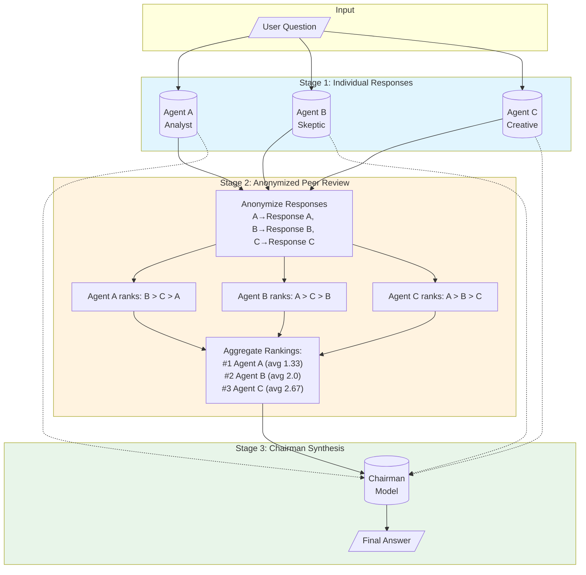
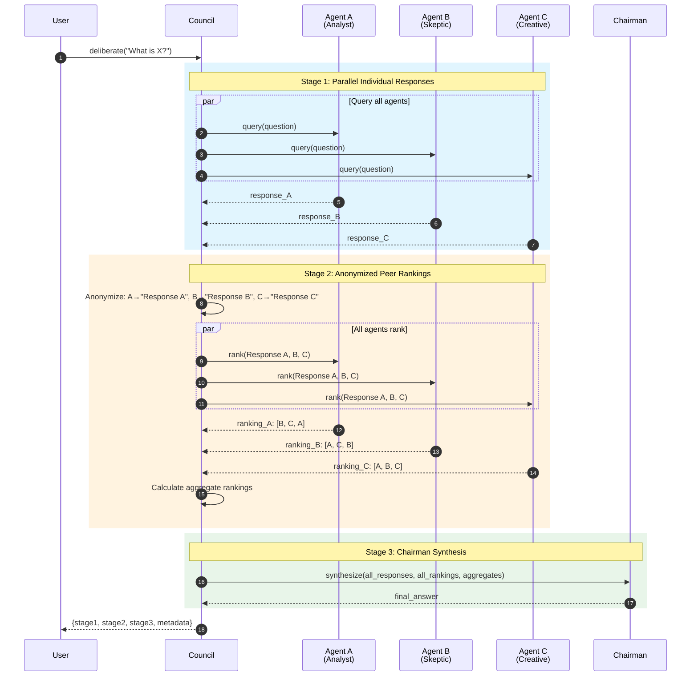
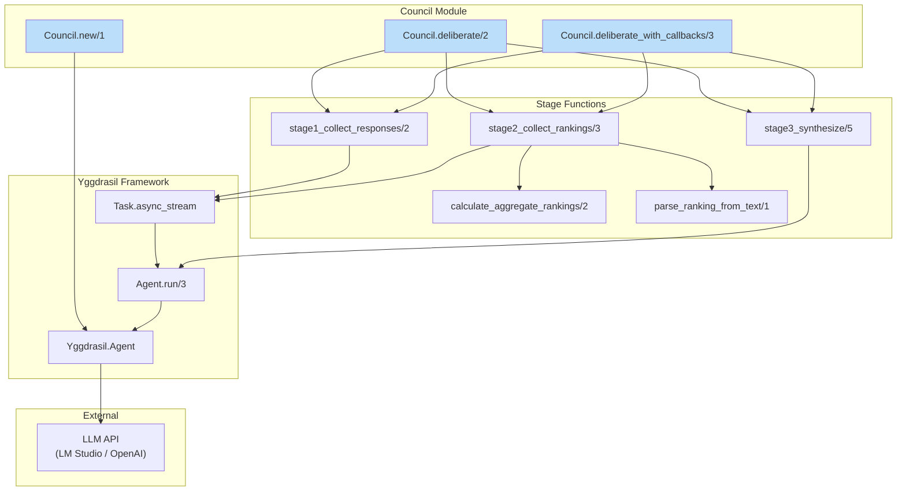
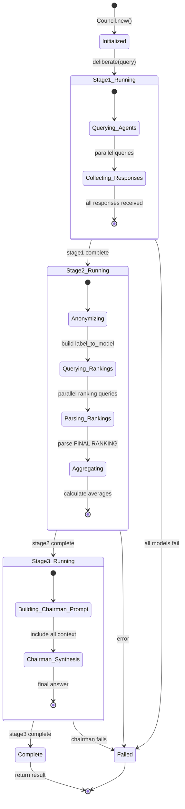
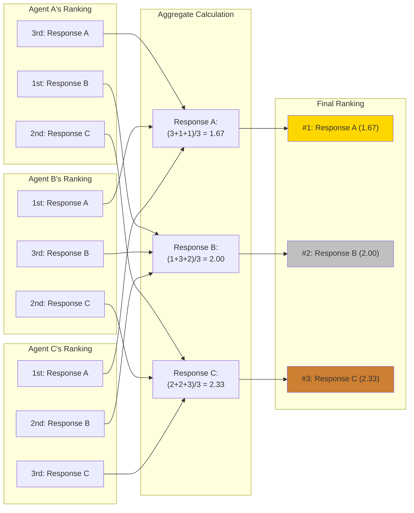

# LLM Council Design Document for Yggdrasil

## Overview

This document captures the analysis of the [nyo16/llm-council](https://github.com/nyo16/llm-council) repository and outlines the design for implementing an LLM Council example in the Yggdrasil Elixir framework.

---

## Part 1: Analysis of llm-council Repository

### 1.1 Core Concept

An LLM Council is a **3-stage deliberation system** where multiple LLMs collaboratively answer user questions:

```
User Query
    ↓
┌─────────────────────────────────────────────────────────────┐
│ STAGE 1: Individual Responses                               │
│ All council models respond to the question in parallel      │
└─────────────────────────────────────────────────────────────┘
    ↓
┌─────────────────────────────────────────────────────────────┐
│ STAGE 2: Peer Review (Anonymized)                           │
│ Each model ranks all responses (as "Response A, B, C...")   │
│ Identities are hidden to prevent bias                       │
└─────────────────────────────────────────────────────────────┘
    ↓
┌─────────────────────────────────────────────────────────────┐
│ STAGE 3: Chairman Synthesis                                 │
│ A designated "Chairman" model synthesizes final answer      │
│ using all responses + rankings as context                   │
└─────────────────────────────────────────────────────────────┘
    ↓
Final Comprehensive Answer
```

### 1.2 Key Design Decisions

#### Anonymization Strategy (Critical)
- **Why**: Prevents models from playing favorites or being biased toward/against specific providers
- **How**: Responses are labeled as "Response A", "Response B", etc.
- **De-anonymization**: A mapping `{"Response A": "openai/gpt-4", ...}` is maintained for display purposes only
- **Display**: Frontend shows model names in **bold** for user readability, with explanation that original evaluation used anonymous labels

#### Graceful Degradation
- If a model fails, continue with successful responses
- Never fail the entire request due to a single model failure
- Log errors but don't expose to users unless ALL models fail

#### Parallel Execution
- Stage 1: All models queried in parallel (`asyncio.gather`)
- Stage 2: All ranking queries run in parallel
- Title generation runs in parallel with main pipeline

### 1.3 Prompts Analysis

#### Stage 2: Ranking Prompt
```
Evaluate responses to: {user_query}

Response A:
{response_a_text}

Response B:
{response_b_text}

Response C:
{response_c_text}

Analyze each response, then provide FINAL RANKING:
1. Response [letter]
2. Response [letter]
etc.
```

**Requirements for parseable output:**
1. Evaluate each response individually first
2. Provide "FINAL RANKING:" header
3. Numbered list format: "1. Response C", "2. Response A", etc.
4. No additional text after ranking section

#### Stage 3: Chairman Synthesis Prompt
```
You are Chairman of an LLM Council.

Original Question: {user_query}

STAGE 1 - Individual Responses:
Model: {model_name}
Response: {response_text}
...

STAGE 2 - Peer Rankings:
Model: {model_name}
Ranking: {ranking_text}
...

Synthesize into a comprehensive answer.
```

### 1.4 Data Flow

```
┌──────────────────────────────────────────────────────────────────┐
│                        API Request                               │
│  POST /api/conversations/{id}/message  {"content": "..."}        │
└──────────────────────────────────────────────────────────────────┘
                              │
                              ▼
┌──────────────────────────────────────────────────────────────────┐
│  stage1_collect_responses(user_query)                            │
│  ├─ query_models_parallel([model1, model2, model3, model4])      │
│  │   ├─ query_model(model1, messages) ─────────┐                 │
│  │   ├─ query_model(model2, messages) ─────────┤ (parallel)      │
│  │   ├─ query_model(model3, messages) ─────────┤                 │
│  │   └─ query_model(model4, messages) ─────────┘                 │
│  └─ return [{model, response}, ...]                              │
└──────────────────────────────────────────────────────────────────┘
                              │
                              ▼
┌──────────────────────────────────────────────────────────────────┐
│  stage2_collect_rankings(user_query, stage1_results)             │
│  ├─ Anonymize: create labels (A, B, C, D)                        │
│  ├─ Build label_to_model mapping                                 │
│  ├─ query_models_parallel with ranking_prompt                    │
│  ├─ Parse each ranking: parse_ranking_from_text()                │
│  └─ return (rankings_list, label_to_model)                       │
└──────────────────────────────────────────────────────────────────┘
                              │
                              ▼
┌──────────────────────────────────────────────────────────────────┐
│  calculate_aggregate_rankings(stage2_results, label_to_model)    │
│  ├─ For each ranking, extract positions                          │
│  ├─ Average rank per model across all evaluations                │
│  └─ Sort by average rank (lower is better)                       │
└──────────────────────────────────────────────────────────────────┘
                              │
                              ▼
┌──────────────────────────────────────────────────────────────────┐
│  stage3_synthesize_final(query, stage1, stage2)                  │
│  ├─ Build chairman_prompt with all context                       │
│  ├─ query_model(CHAIRMAN_MODEL, messages)                        │
│  └─ return {model, response}                                     │
└──────────────────────────────────────────────────────────────────┘
                              │
                              ▼
┌──────────────────────────────────────────────────────────────────┐
│  Return: {stage1, stage2, stage3, metadata}                      │
│  metadata = {label_to_model, aggregate_rankings}                 │
└──────────────────────────────────────────────────────────────────┘
```

### 1.5 File Structure Summary

```
llm-council/
├── backend/
│   ├── config.py        # COUNCIL_MODELS, CHAIRMAN_MODEL, API keys
│   ├── council.py       # Core 3-stage orchestration logic
│   ├── openrouter.py    # API client (query_model, query_models_parallel)
│   ├── storage.py       # JSON conversation persistence
│   └── main.py          # FastAPI endpoints with streaming support
├── frontend/src/
│   ├── App.jsx          # Main orchestration, state management
│   ├── api.js           # API client with SSE streaming
│   └── components/
│       ├── Stage1.jsx   # Tabbed individual responses
│       ├── Stage2.jsx   # Rankings with de-anonymization
│       ├── Stage3.jsx   # Chairman's final answer
│       ├── ChatInterface.jsx  # Message display
│       └── Sidebar.jsx  # Conversation list
└── CLAUDE.md            # Comprehensive technical notes
```

---

## Part 2: Mermaid Diagrams

### 2.1 High-Level Flow (Mermaid)



### 2.2 Sequence Diagram (Mermaid)



### 2.3 Component Architecture (Mermaid)



### 2.4 Data Flow State Machine (Mermaid)



### 2.5 Ranking Aggregation (Mermaid)



---

## Part 3: ASCII Sequence Diagrams (Alternative)

### 3.1 Full Council Flow (ASCII)

```
┌─────┐      ┌─────────┐      ┌─────────┐      ┌─────────┐      ┌─────────┐
│User │      │ API     │      │ Model A │      │ Model B │      │Chairman │
└──┬──┘      └────┬────┘      └────┬────┘      └────┬────┘      └────┬────┘
   │              │                │                │                │
   │ "What is X?" │                │                │                │
   │─────────────>│                │                │                │
   │              │                │                │                │
   │              │ ═══════════════ STAGE 1 ═══════════════════════  │
   │              │                │                │                │
   │              │  query(prompt) │                │                │
   │              │───────────────>│                │                │
   │              │  query(prompt) │                │                │
   │              │────────────────────────────────>│                │
   │              │                │                │                │
   │              │  response_A    │                │                │
   │              │<───────────────│                │                │
   │              │  response_B    │                │                │
   │              │<────────────────────────────────│                │
   │              │                │                │                │
   │              │ ═══════════════ STAGE 2 ═══════════════════════  │
   │              │                │                │                │
   │              │ Anonymize responses as A, B    │                │
   │              │                │                │                │
   │              │  rank(A,B)     │                │                │
   │              │───────────────>│                │                │
   │              │  rank(A,B)     │                │                │
   │              │────────────────────────────────>│                │
   │              │                │                │                │
   │              │  ranking_A     │                │                │
   │              │<───────────────│                │                │
   │              │  ranking_B     │                │                │
   │              │<────────────────────────────────│                │
   │              │                │                │                │
   │              │ Calculate aggregate rankings   │                │
   │              │                │                │                │
   │              │ ═══════════════ STAGE 3 ═══════════════════════  │
   │              │                │                │                │
   │              │  synthesize(responses, rankings)                │
   │              │─────────────────────────────────────────────────>│
   │              │                │                │                │
   │              │                │                │   final_answer │
   │              │<─────────────────────────────────────────────────│
   │              │                │                │                │
   │ {s1,s2,s3}   │                │                │                │
   │<─────────────│                │                │                │
   │              │                │                │                │
```

### 3.2 Streaming Flow (SSE)

```
┌─────┐           ┌─────────┐           ┌──────────────────┐
│User │           │Frontend │           │   Backend API    │
└──┬──┘           └────┬────┘           └────────┬─────────┘
   │                   │                         │
   │ Submit question   │                         │
   │──────────────────>│                         │
   │                   │                         │
   │                   │  POST /message/stream   │
   │                   │────────────────────────>│
   │                   │                         │
   │                   │  SSE: stage1_start      │
   │                   │<────────────────────────│
   │ Show spinner S1   │                         │
   │<──────────────────│                         │
   │                   │                         │
   │                   │  SSE: stage1_complete   │
   │                   │<────────────────────────│
   │ Display responses │                         │
   │<──────────────────│                         │
   │                   │                         │
   │                   │  SSE: stage2_start      │
   │                   │<────────────────────────│
   │ Show spinner S2   │                         │
   │<──────────────────│                         │
   │                   │                         │
   │                   │  SSE: stage2_complete   │
   │                   │<────────────────────────│
   │ Display rankings  │                         │
   │<──────────────────│                         │
   │                   │                         │
   │                   │  SSE: stage3_start      │
   │                   │<────────────────────────│
   │ Show spinner S3   │                         │
   │<──────────────────│                         │
   │                   │                         │
   │                   │  SSE: stage3_complete   │
   │                   │<────────────────────────│
   │ Display final     │                         │
   │<──────────────────│                         │
   │                   │                         │
   │                   │  SSE: complete          │
   │                   │<────────────────────────│
```

---

## Part 4: Yggdrasil Implementation Design

### 4.1 Architecture Overview

```
┌─────────────────────────────────────────────────────────────────┐
│                    Yggdrasil LLM Council                        │
├─────────────────────────────────────────────────────────────────┤
│                                                                 │
│  ┌─────────────────┐    ┌─────────────────────────────────┐    │
│  │   Council       │    │     Council Member Agents        │    │
│  │   Supervisor    │───>│  ┌─────────┐ ┌─────────┐        │    │
│  │   (GenServer)   │    │  │Agent A  │ │Agent B  │ ...    │    │
│  └─────────────────┘    │  │(GPT-4)  │ │(Claude) │        │    │
│           │             │  └─────────┘ └─────────┘        │    │
│           │             └─────────────────────────────────┘    │
│           │                                                     │
│           ▼             ┌─────────────────────────────────┐    │
│  ┌─────────────────┐    │       Chairman Agent            │    │
│  │   Stage         │───>│  (Synthesis/Final Answer)       │    │
│  │   Orchestrator  │    └─────────────────────────────────┘    │
│  └─────────────────┘                                           │
│                                                                 │
└─────────────────────────────────────────────────────────────────┘
```

### 4.2 Module Structure

```
examples/
└── council/
    ├── council_demo.exs           # Main demo script
    ├── council.ex                 # Core orchestration module
    ├── council_config.ex          # Configuration (models, prompts)
    └── council_server.ex          # Optional GenServer wrapper
```

### 4.3 Core Data Types

```elixir
defmodule Council.Types do
  @type model_response :: %{
    model: String.t(),
    response: String.t()
  }

  @type ranking :: %{
    model: String.t(),
    ranking: String.t(),
    parsed_ranking: [String.t()]
  }

  @type aggregate_ranking :: %{
    model: String.t(),
    average_rank: float(),
    rankings_count: non_neg_integer()
  }

  @type council_result :: %{
    stage1: [model_response()],
    stage2: [ranking()],
    stage3: model_response(),
    metadata: %{
      label_to_model: map(),
      aggregate_rankings: [aggregate_ranking()]
    }
  }
end
```

### 4.4 Core Module Design

```elixir
defmodule Council do
  @moduledoc """
  LLM Council - Multi-model deliberation system.

  Implements a 3-stage process:
  1. Collect individual responses from all council members
  2. Each member ranks all responses (anonymized)
  3. Chairman synthesizes final answer
  """

  alias Yggdrasil.Agent

  defstruct [
    :council_models,    # List of model strings
    :chairman_model,    # Model string for synthesis
    :agents,            # Map of model -> Agent struct
    :chairman_agent     # Agent struct for chairman
  ]

  @doc "Create a new council with specified models"
  def new(council_models, chairman_model, opts \\ [])

  @doc "Run the full 3-stage council process"
  def deliberate(council, query)

  @doc "Run with streaming callbacks for each stage"
  def deliberate_stream(council, query, callbacks)
end
```

### 4.5 Implementation Flow

```elixir
defmodule Council do
  # Stage 1: Parallel responses
  defp stage1_collect_responses(council, query) do
    council.council_models
    |> Task.async_stream(fn model ->
      agent = Map.get(council.agents, model)
      case Yggdrasil.run(agent, query) do
        {:ok, result} -> %{model: model, response: result.output}
        {:error, _} -> nil
      end
    end, max_concurrency: length(council.council_models))
    |> Enum.map(fn {:ok, result} -> result end)
    |> Enum.filter(& &1)  # Remove nils (failed responses)
  end

  # Stage 2: Anonymized ranking
  defp stage2_collect_rankings(council, query, stage1_results) do
    {labels, label_to_model} = anonymize_responses(stage1_results)
    ranking_prompt = build_ranking_prompt(query, labels, stage1_results)

    rankings = council.council_models
    |> Task.async_stream(fn model ->
      agent = Map.get(council.agents, model)
      case Yggdrasil.run(agent, ranking_prompt) do
        {:ok, result} ->
          %{
            model: model,
            ranking: result.output,
            parsed_ranking: parse_ranking(result.output)
          }
        {:error, _} -> nil
      end
    end)
    |> Enum.map(fn {:ok, result} -> result end)
    |> Enum.filter(& &1)

    {rankings, label_to_model}
  end

  # Stage 3: Chairman synthesis
  defp stage3_synthesize(council, query, stage1, stage2) do
    chairman_prompt = build_chairman_prompt(query, stage1, stage2)

    case Yggdrasil.run(council.chairman_agent, chairman_prompt) do
      {:ok, result} ->
        %{model: council.chairman_model, response: result.output}
      {:error, reason} ->
        %{model: council.chairman_model, response: "Error: #{inspect(reason)}"}
    end
  end
end
```

### 4.6 Prompts

```elixir
defmodule Council.Prompts do
  @ranking_prompt """
  You are evaluating responses to the following question:

  QUESTION: <%= query %>

  Here are the responses to evaluate:

  <%= for {label, response} <- labeled_responses do %>
  <%= label %>:
  <%= response %>

  <% end %>

  Please analyze each response for:
  1. Accuracy and correctness
  2. Completeness
  3. Clarity and helpfulness

  Then provide your FINAL RANKING in this exact format:

  FINAL RANKING:
  1. Response [letter]
  2. Response [letter]
  3. Response [letter]
  (etc.)

  Rank from best to worst. Do not include any text after the ranking.
  """

  @chairman_prompt """
  You are the Chairman of an LLM Council. Your role is to synthesize
  multiple expert opinions into one comprehensive, authoritative answer.

  ORIGINAL QUESTION:
  <%= query %>

  STAGE 1 - Individual Expert Responses:
  <%= for resp <- stage1_results do %>
  Expert (<%= resp.model %>):
  <%= resp.response %>

  <% end %>

  STAGE 2 - Peer Rankings (how experts ranked each other):
  <%= for ranking <- stage2_results do %>
  Reviewer (<%= ranking.model %>):
  <%= ranking.ranking %>

  <% end %>

  AGGREGATE RANKINGS (average position, lower is better):
  <%= for agg <- aggregate_rankings do %>
  - <%= agg.model %>: <%= agg.average_rank %> (from <%= agg.rankings_count %> votes)
  <% end %>

  Based on all of the above, synthesize a comprehensive final answer that:
  1. Incorporates the strongest points from top-ranked responses
  2. Addresses any concerns raised in the peer reviews
  3. Provides a clear, authoritative answer to the original question

  YOUR SYNTHESIS:
  """

  def ranking_prompt(query, labeled_responses) do
    EEx.eval_string(@ranking_prompt,
      query: query,
      labeled_responses: labeled_responses
    )
  end

  def chairman_prompt(query, stage1_results, stage2_results, aggregate_rankings) do
    EEx.eval_string(@chairman_prompt,
      query: query,
      stage1_results: stage1_results,
      stage2_results: stage2_results,
      aggregate_rankings: aggregate_rankings
    )
  end
end
```

### 4.7 Example Usage

```elixir
# examples/council/council_demo.exs

# Define council members (using local LM Studio)
council_models = [
  "lmstudio:qwen/qwen3-4b-2507",
  "lmstudio:qwen/qwen3-4b-2507",  # Can use same model with different prompts
  "lmstudio:qwen/qwen3-4b-2507"
]

# Chairman can be the same or a stronger model
chairman_model = "lmstudio:qwen/qwen3-4b-2507"

# Create the council
council = Council.new(council_models, chairman_model)

# Ask a question
question = "What are the key factors to consider when designing a distributed system?"

# Run deliberation
{:ok, result} = Council.deliberate(council, question)

# Display results
IO.puts("\n=== STAGE 1: Individual Responses ===")
for resp <- result.stage1 do
  IO.puts("\n--- #{resp.model} ---")
  IO.puts(resp.response)
end

IO.puts("\n=== STAGE 2: Peer Rankings ===")
for ranking <- result.stage2 do
  IO.puts("\n--- #{ranking.model}'s Ranking ---")
  IO.puts(ranking.ranking)
  IO.puts("Parsed: #{inspect(ranking.parsed_ranking)}")
end

IO.puts("\n=== AGGREGATE RANKINGS ===")
for agg <- result.metadata.aggregate_rankings do
  IO.puts("#{agg.model}: avg #{agg.average_rank} (#{agg.rankings_count} votes)")
end

IO.puts("\n=== STAGE 3: Chairman's Final Answer ===")
IO.puts("Chairman: #{result.stage3.model}")
IO.puts(result.stage3.response)
```

### 4.8 Leveraging Yggdrasil Features

| Feature | Usage in Council |
|---------|-----------------|
| `Task.async_stream` | Parallel model queries (Stage 1 & 2) |
| `Yggdrasil.Agent` | Each council member as an agent |
| `RunContext.deps` | Pass council state, previous results |
| `message_history` | Multi-turn debates (optional extension) |
| Streaming | Real-time stage-by-stage updates |
| Telemetry | Monitor council performance |
| Registry | Named council agents for distributed setup |

### 4.9 Extension Ideas

1. **Multi-Round Debate**: Allow multiple rounds of discussion before final synthesis
2. **Weighted Voting**: Give more weight to models that consistently rank well
3. **Specialist Roles**: Assign different system prompts (critic, advocate, skeptic)
4. **Tool-Based Delegation**: Coordinator agent delegates to specialists via tools
5. **Streaming**: Real-time updates as each stage completes
6. **Persistence**: Save council deliberations for analysis

---

## Part 5: Local Testing with LM Studio

Your local LLM is available at:
```bash
curl http://localhost:1234/v1/chat/completions \
  -H "Content-Type: application/json" \
  -d '{
    "model": "qwen/qwen3-4b-2507",
    "messages": [{"role": "user", "content": "Hello"}],
    "temperature": 0.7
  }'
```

For Yggdrasil, use:
```elixir
agent = Yggdrasil.new("lmstudio:qwen/qwen3-4b-2507",
  model_settings: %{temperature: 0.7}
)
```

The base URL `http://localhost:1234/v1` should be configured in your environment or model settings.

---

## Summary

The LLM Council pattern provides:
- **Diverse perspectives**: Multiple models approach problems differently
- **Peer review**: Built-in quality control through anonymous ranking
- **Synthesis**: Chairman combines best insights into authoritative answer
- **Transparency**: All stages visible for user verification

Yggdrasil's features (parallel execution, agents, streaming, telemetry) make it an excellent fit for implementing this pattern.
