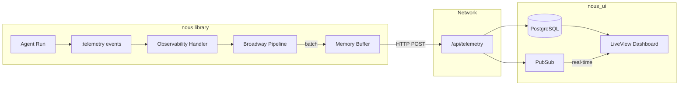
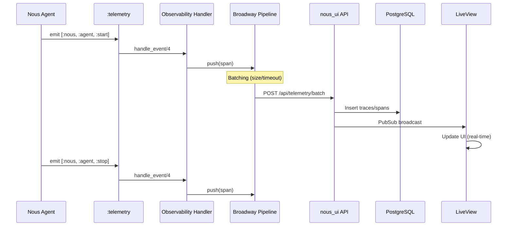
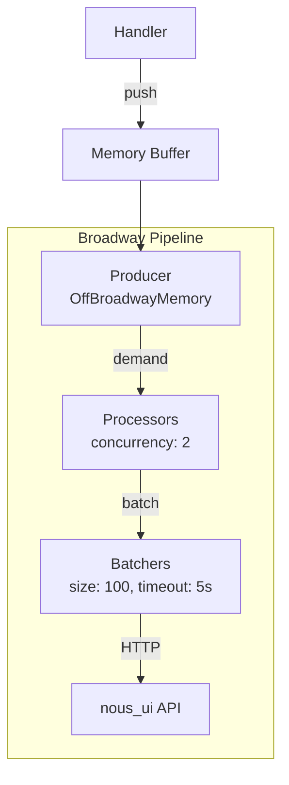
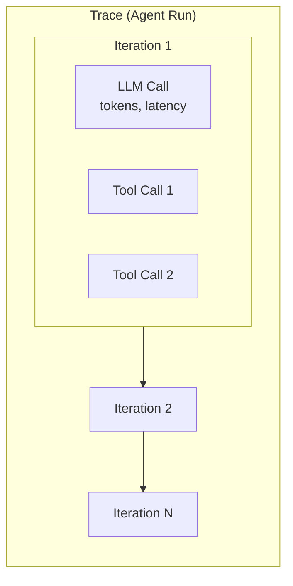
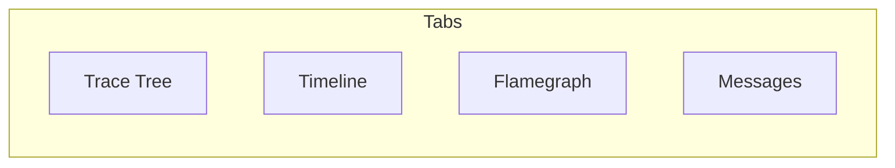

# Observability & nous_ui Integration

This guide explains how to use the Nous observability module to visualize agent runs in the nous_ui dashboard.

## Overview

The observability module provides an opt-in telemetry export system that captures agent execution events and sends them to a nous_ui instance for visualization and analysis.



## Architecture

### Event Flow



### Broadway Pipeline Benefits

The observability module uses [Broadway](https://github.com/dashbitco/broadway) for reliable, efficient telemetry export:

- **Non-blocking**: Events are pushed to an in-memory buffer, never blocking agent execution
- **Batching**: Spans are batched before sending to reduce HTTP overhead
- **Back-pressure**: Built-in flow control prevents overwhelming nous_ui
- **Fault tolerance**: Automatic retries and graceful degradation
- **Graceful shutdown**: Pending spans are flushed on application stop



## Setup

### 1. Add Dependencies

Add Broadway dependencies to your `mix.exs` (optional deps):

```elixir
def deps do
  [
    {:nous, "~> 0.8"},
    {:broadway, "~> 1.0"},
    {:off_broadway_memory, "~> 1.2"}
  ]
end
```

### 2. Start nous_ui

```bash
cd nous_ui
mix ecto.create && mix ecto.migrate
mix phx.server
```

The dashboard will be available at http://localhost:4000

### 3. Enable Observability

#### Option A: Runtime Configuration

```elixir
# Enable at runtime
Nous.Observability.enable(
  endpoint: "http://localhost:4000/api/telemetry"
)

# Run your agent
{:ok, result} = Nous.run(agent, "Hello!")

# Disable when done (optional)
Nous.Observability.disable()
```

#### Option B: Application Configuration

```elixir
# config/config.exs
config :nous,
  observability: [
    enabled: true,
    endpoint: "http://localhost:4000/api/telemetry",
    batch_size: 100,
    batch_timeout: 5_000,
    concurrency: 2
  ]
```

Then in your application startup:

```elixir
# application.ex
def start(_type, _args) do
  children = [
    # ... your other children
  ]

  # Enable observability if configured
  if Application.get_env(:nous, :observability)[:enabled] do
    Nous.Observability.enable()
  end

  Supervisor.start_link(children, strategy: :one_for_one)
end
```

## Configuration Options

| Option | Default | Description |
|--------|---------|-------------|
| `endpoint` | required | nous_ui API endpoint URL |
| `batch_size` | 100 | Number of spans to batch before sending |
| `batch_timeout` | 5000 | Max ms to wait before sending a partial batch |
| `concurrency` | 2 | Number of concurrent HTTP senders |
| `max_demand` | 50 | Back-pressure control parameter |
| `headers` | [] | Additional HTTP headers (e.g., auth tokens) |

## What Gets Captured

The observability module captures telemetry events from agent execution:



### Captured Metrics

- **Trace level**: Agent name, model, total duration, token usage, iteration count, tool call count
- **Span level**:
  - LLM calls: Model, tokens (input/output), latency, messages
  - Tool calls: Tool name, arguments, result, duration
  - Iterations: Sequence number, duration

### OpenTelemetry Alignment

Spans use OpenTelemetry semantic conventions where applicable:

```json
{
  "trace_id": "abc123...",
  "span_id": "def456...",
  "name": "gen_ai.chat",
  "attributes": {
    "gen_ai.provider.name": "openai",
    "gen_ai.request.model": "gpt-4",
    "gen_ai.usage.input_tokens": 150,
    "gen_ai.usage.output_tokens": 450
  }
}
```

## nous_ui Visualizations

### Dashboard

The main dashboard shows:
- Active runs (real-time)
- Recent runs
- Aggregate statistics (total tokens, success rate, etc.)

### Run Detail Page

Each run has multiple visualization tabs:



1. **Trace Tree**: Hierarchical view of spans with expand/collapse
2. **Timeline**: Gantt chart showing parallel execution
3. **Flamegraph**: Performance visualization for identifying bottlenecks
4. **Messages**: Full conversation history

## Performance Impact

The observability module is designed for minimal impact:

| Aspect | Impact |
|--------|--------|
| Agent latency | ~0ms (async, non-blocking) |
| Memory | Small buffer for pending spans |
| Network | Batched HTTP requests |
| CPU | Minimal (Broadway handles concurrency) |

The module gracefully handles failures - if nous_ui is unavailable, spans are dropped without affecting agent execution.

## Troubleshooting

### Spans not appearing in nous_ui

1. Check nous_ui is running: `curl http://localhost:4000/api/telemetry`
2. Verify observability is enabled: `Nous.Observability.enabled?()` should return `true`
3. Check logs for HTTP errors
4. Ensure batch_timeout has elapsed (default 5s) or batch_size is reached

### Broadway not available error

Ensure you've added the optional dependencies:

```elixir
{:broadway, "~> 1.0"},
{:off_broadway_memory, "~> 1.2"}
```

Then run `mix deps.get && mix deps.compile`.

## Example

```elixir
# Define tools
defmodule MyTools do
  def get_weather(_ctx, %{"city" => city}) do
    {:ok, "Weather in #{city}: 72°F, sunny"}
  end
end

# Enable observability
Nous.Observability.enable(endpoint: "http://localhost:4000/api/telemetry")

# Create and run agent
agent = Nous.new("openai:gpt-4",
  name: "Weather Assistant",
  instructions: "Help users check the weather.",
  tools: [&MyTools.get_weather/2]
)

{:ok, result} = Nous.run(agent, "What's the weather in Tokyo?")

# View at http://localhost:4000
```
